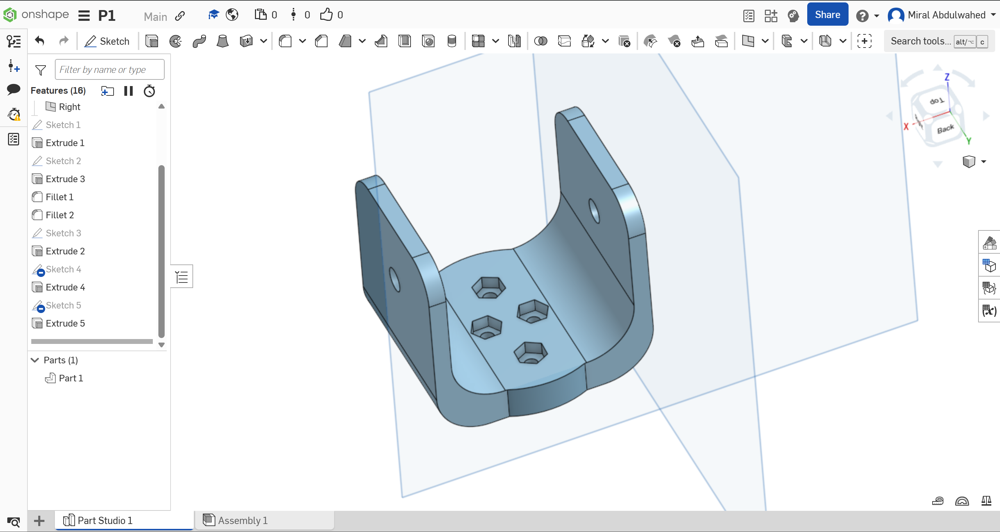

# 🤖 U-Bracket Mount for Robotic Arm

This is a custom-designed **U-bracket component** intended for use in a **robotic arm**. It was created using the **Onshape** online CAD platform.

---

---

## 🛠️ Design Steps

The part was created in **Onshape** using the following process:

### 1. ✏️ U-Shape Sketch
- Drew a **U-shaped profile** using **8 connected lines** to form the base and side walls.
- This served as the main structure of the bracket.

### 2. 📦 Extrude 3D
- Used the **Extrude tool** to convert the 2D U-shape into a 3D solid bracket.

### 3. 🔘 Circular Add-On at Base
- Sketched a **circle** at the bottom center of the U-shape.
- Extruded it using the **"Add" option** to fuse it with the existing body — possibly to support another mounting component or strengthen the base.

### 4. 🌀 Fillets for Smoother Edges
- Applied **fillet features** to the sharp corners to:
  - Smooth the part for handling and assembly.
  - Improve structural strength by reducing stress points.
  - Add a sleek, curved appearance to the bracket.

### 5. 🕳️ Openings for Assembly
- Added **circular holes** on the vertical side walls — likely for rotational joints or pins.
- Created **hexagonal holes** on the bottom platform — designed to fit hex-head bolts securely.
- Used **Extrude Remove** to cut through the body with both shapes.

---

## 🧰 Tools Used

- ✅ Sketch (Lines & Circles)
- ✅ Extrude (Add & Remove)
- ✅ Fillet (Edge smoothing)
- ✅ Boolean operations (via Onshape’s Add option)

---

## 📸 Preview

>   
> *Solid U-bracket with bolt cutouts and pinholes*

---

## 💡 Intended Use

This bracket is ideal for:
- 🤖 **Robot arm joints** and servo mounts
- 🔧 **Structural frames** in robotics or DIY mechatronics
- 🛠 **Custom mechanical assemblies** with bolt and pin integration

---

## 📜 License

This design is shared under the MIT License.  
Feel free to copy, modify, and integrate into your own robotic projects.

---

## 🙌 Credits

Designed by **Miral Abdulwahed** using [Onshape](https://www.onshape.com/).  
Great for educational, hobbyist, and prototyping purposes!

https://cad.onshape.com/documents/537b9db094150a0394611409/w/cc4da5761f0c093aa4475f23/e/4bbb944d1d782ed0d7921ab2?renderMode=0&uiState=687e0ff7d1f81f35e34dfc58
